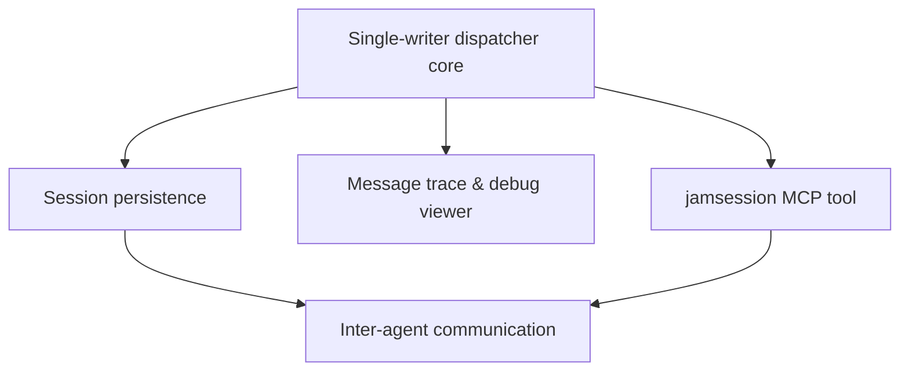

# Build-Out Roadmap

This page is the authoritative **done / in-flight / planned** status surface for
Jamsession's build-out. It is a **rollup**: it adds the one view no single RFD has — how the
work groups fit together (sequencing, dependencies), what is built versus still planned, and
which [architecture decisions](../design/decisions.md) each group realizes or must honor.

It deliberately does **not** duplicate:

- **Per-step status** — that lives in each RFD's `implementation.md` checkboxes.
- **Design rationale and alternatives** — those live in the [architecture pages](../design/README.md)
  and the RFD `README.md`s.

Each entry links out to those instead of restating them. When this page and a linked page
disagree, **the linked page wins** — treat a mismatch here as a stale roadmap entry to fix.

## How to read this

**Status vocabulary** (one of):

- **Done** — the work is built and reflected in the architecture; its RFD (if any) is in
  [Completed](../rfds/completed.md).
- **In flight** — actively being built; its RFD is in [Accepted](../rfds/accepted.md) and not
  all steps in its `implementation.md` are ticked.
- **Planned** — the design exists (in an architecture page or a draft RFD) but implementation
  has not started.
- *Proposed* — reserved for an RFD under review that has not yet been accepted. No entries
  today.

**How status is derived** (so it is mechanical, not a judgment call): a group is *Done* when
its RFD is in `completed.md` (or, for pre-RFD foundation, the design reads as built);
*In flight* when its RFD is in `accepted.md` with unticked steps; *Planned* otherwise. This
page never invents status — it derives it from the RFD buckets and each `implementation.md`.

**What each entry carries:** name, status, RFD link(s), the `D<n>` decisions it realizes or
honors, its dependencies (and anything it can run in parallel with), and a one-line scope.
Nothing more.

## Status at a glance

| Task group | Status | RFD | Realizes / honors | Depends on |
|---|---|---|---|---|
| Single-writer dispatcher core | Done | *(pre-RFD foundation)* | [D1](../design/decisions.md#d1--single-writer-dispatcher), [D2](../design/decisions.md#d2--timers-as-messages-invalidated-by-a-generation-counter), [D5](../design/decisions.md#d5--the-daemon-is-the-sole-acp-endpoint) | — |
| RFD process | Done | [rfd-process](../rfds/rfd-process/README.md) | — | — |
| Session persistence | Done | [session-persistence](../rfds/session-persistence/README.md) | [D3](../design/decisions.md#d3--ephemeral-agents-the-daemon-owns-and-replays-history), [D6](../design/decisions.md#d6--persistence-is-sqlite-via-toasty) | Dispatcher core |
| Message trace & debug viewer | Done | [message-trace](../rfds/message-trace/README.md) | honors [D1](../design/decisions.md#d1--single-writer-dispatcher) | Dispatcher core |
| `jamsession` MCP tool | Done | [jamsession-tool](../rfds/inter-agent-communication/jamsession-tool/README.md) | honors [D5](../design/decisions.md#d5--the-daemon-is-the-sole-acp-endpoint) | Dispatcher core |
| Inter-agent communication | Done | [inter-agent-communication](../rfds/inter-agent-communication/README.md) | [D4](../design/decisions.md#d4--an-agents-identity-is-its-session-id), [D7](../design/decisions.md#d7--a-session-belongs-to-at-most-one-team) | Session persistence, `jamsession` MCP tool |

## Core (built)

The foundation the rest of the system is built on, plus the features that have shipped.

### Single-writer dispatcher core — Done

- **Scope:** The actor that owns all session state and serializes every change through one
  message loop; the daemon's routing, lifecycle, and timer machinery.
- **RFD:** *(pre-RFD foundation)* — design in [Architecture & Design](../design/README.md).
- **Realizes:** [D1](../design/decisions.md#d1--single-writer-dispatcher),
  [D2](../design/decisions.md#d2--timers-as-messages-invalidated-by-a-generation-counter),
  [D5](../design/decisions.md#d5--the-daemon-is-the-sole-acp-endpoint).
- **Depends on:** —

### RFD process — Done

- **Scope:** The RFD workflow itself — template, `accepted`/`completed` buckets, and the
  process for proposing and tracking design changes.
- **RFD:** [rfd-process](../rfds/rfd-process/README.md) (completed) ·
  steps: [implementation.md](../rfds/rfd-process/implementation.md).
- **Realizes:** —
- **Depends on:** —

### Session persistence — Done

- **Scope:** Session metadata and conversation history persisted in SQLite so sessions
  survive daemon restarts and agent respawns.
- **RFD:** [session-persistence](../rfds/session-persistence/README.md) (completed) ·
  steps: [implementation.md](../rfds/session-persistence/implementation.md).
- **Realizes:** [D3](../design/decisions.md#d3--ephemeral-agents-the-daemon-owns-and-replays-history),
  [D6](../design/decisions.md#d6--persistence-is-sqlite-via-toasty).
- **Depends on:** Single-writer dispatcher core.

### Message trace & debug viewer — Done

- **Scope:** Optional recording of ACP dispatches and lifecycle events, with a local debug
  viewer for inspecting them.
- **RFD:** [message-trace](../rfds/message-trace/README.md) (completed) ·
  steps: [implementation.md](../rfds/message-trace/implementation.md).
- **Realizes:** honors [D1](../design/decisions.md#d1--single-writer-dispatcher) (responses routed
  back through the actor loop for canonical trace ordering).
- **Depends on:** Single-writer dispatcher core.

### `jamsession` MCP tool — Done

- **Scope:** The single MCP tool the daemon exposes to each agent, offering CLI-style JSON
  subcommands — the delivery vehicle for inter-agent features.
- **RFD:** [jamsession-tool](../rfds/inter-agent-communication/jamsession-tool/README.md)
  (completed, sub-RFD of inter-agent communication).
- **Realizes:** honors [D5](../design/decisions.md#d5--the-daemon-is-the-sole-acp-endpoint).
- **Depends on:** Single-writer dispatcher core.

### Inter-agent communication — Done

- **Scope:** Team-based messaging between agents (broadcast/send), a shared worklist, and a
  shared key-value store, with human-controlled team membership.
- **RFD:** [inter-agent-communication](../rfds/inter-agent-communication/README.md) ·
  steps: [implementation.md](../rfds/inter-agent-communication/implementation.md).
- **Realizes:** [D4](../design/decisions.md#d4--an-agents-identity-is-its-session-id),
  [D7](../design/decisions.md#d7--a-session-belongs-to-at-most-one-team).
- **Depends on:** Session persistence, `jamsession` MCP tool.

## In flight

_Nothing in flight — all accepted work is complete._

## Planned

_No planned task groups yet. Work out forward-looking design in the
[Architecture & Design](../design/README.md) section first, then record its status here._

<!-- Template for a planned task group — copy, fill, and move to a status section as it
     progresses:

### <Task group name> — Planned

- **Scope:** <one line: the capability, not the design>
- **RFD:** <link to the RFD README if one exists, else `none yet — design in
  [<page>](../design/<page>.md)`>
- **Realizes / honors:** <D-codes it will realize, plus cross-cutting D-codes it must honor,
  or `—`>
- **Depends on:** <task-group name(s) that must land first, or `—`>
- **Parallelizable with:** <task-group name(s); omit if none>
-->

## Sequencing & dependencies

The cross-group view no single RFD carries: what must precede what. Everything rests on the
**dispatcher core**; once persistence is in place, the feature work fans out.

**Core first, then parallelize.** The single-writer dispatcher core is the root — session
persistence, message tracing, and the `jamsession` MCP tool all build directly on it and are
independent of one another, so they can proceed in parallel. Inter-agent communication is the
convergence point: it needs both durable state (session persistence, for at-least-once message
delivery) and the `jamsession` MCP tool (its delivery vehicle) before it can land.
